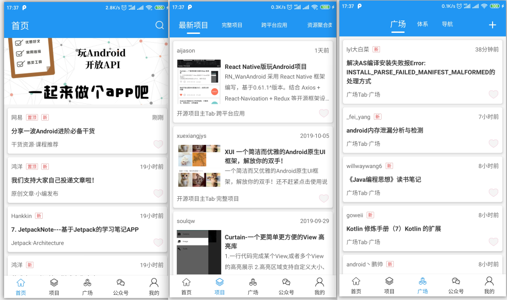
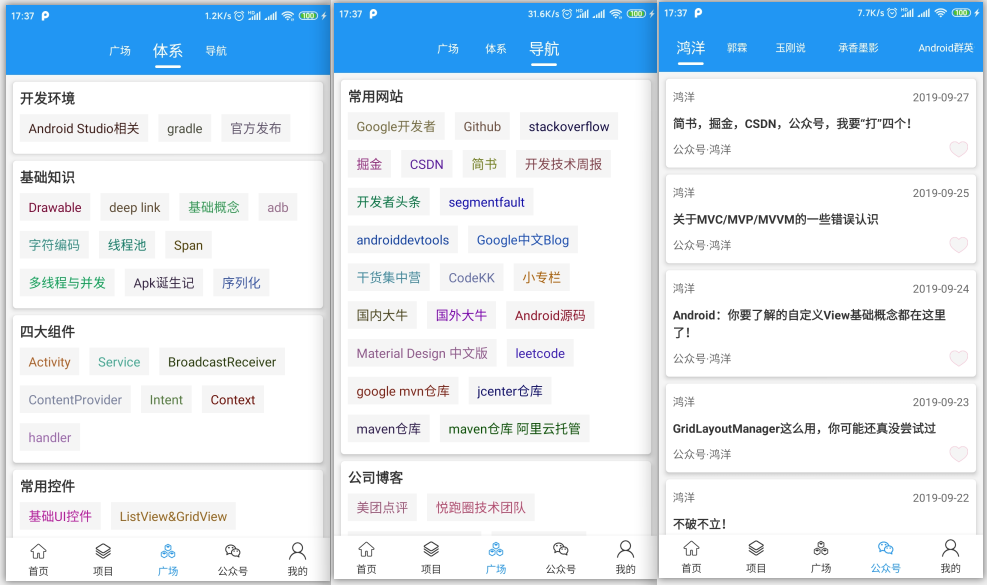
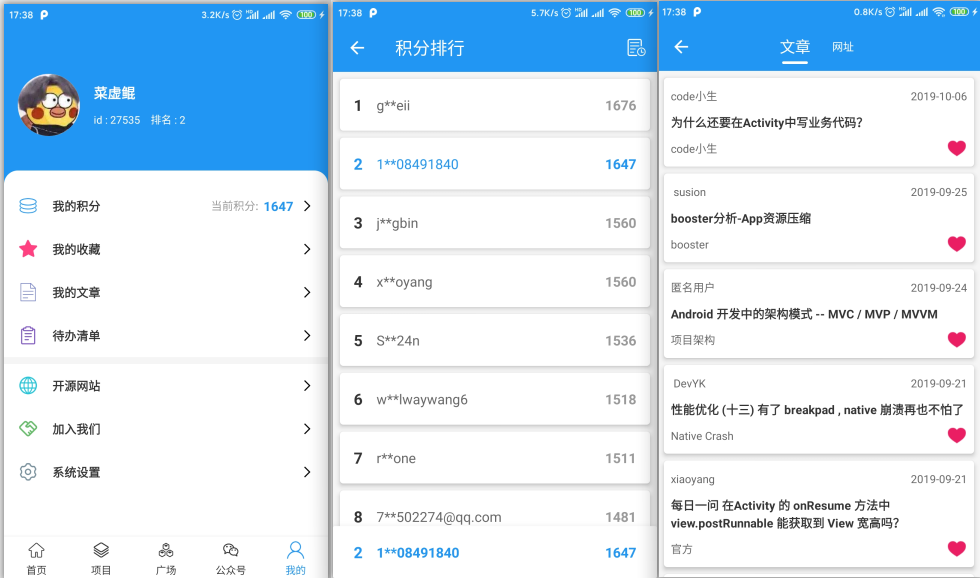
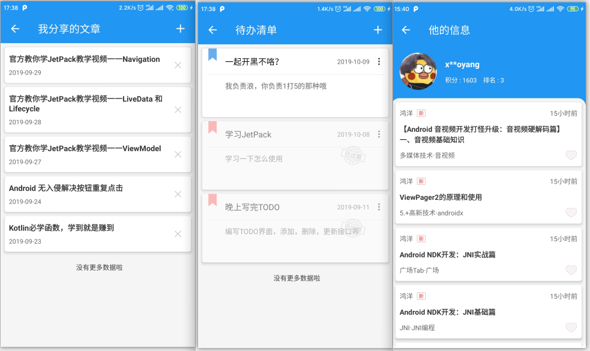
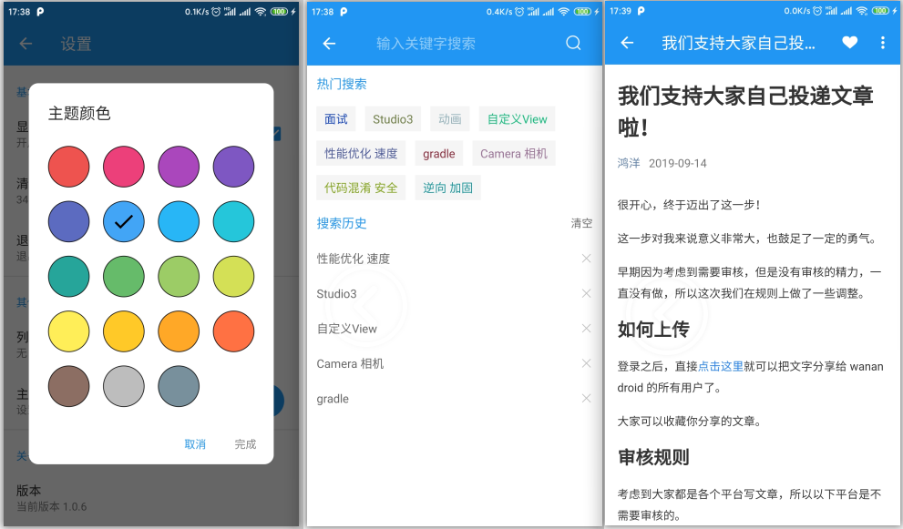

[![Platform][1]][2] [![GitHub license][3]][4]  [![GitHub license][5]][6] 

[1]:https://img.shields.io/badge/platform-Android-blue.svg  
[2]:https://github.com/hegaojian/WanAndroid
[3]:https://img.shields.io/github/release/hegaojian/WanAndroid.svg
[4]:https://github.com/hegaojian/WanAndroid/releases/latest
[5]:https://img.shields.io/badge/license-Apache%202-blue.svg
[6]:https://github.com/hegaojian/WanAndroid/blob/master/LICENSE


# WanAndroid
一位练习时长两年半的安卓练习生根据鸿神提供的[WanAndroid开放Api](https://www.wanandroid.com/blog/show/2)来制作的产品级App,基本实现了所有的功能，采用Kotlin语言，基于Material Design+AndroidX + MVP + RxJava + Retrofit等优秀的开源框架开发,注释超详细，方便大家练手

如果你觉得做的还可以对你有帮助，**容我卑微地向你要个star**，有任何问题或建议，欢迎提交[issues](https://github.com/hegaojian/WanAndroid/issues)

# 前言
前段时间学习了 **Kotlin** ，就打算写一个项目来练练手刷刷熟练度，因为经常逛鸿神的[WanAndroid](https://www.wanandroid.com)网站，觉得很不错，Api也很丰富健全， 虽然根据[WanAndroid](https://www.wanandroid.com)APi开发出的app多如牛毛，有诸多优秀的app,但是每个人的喜好与审美不一样，所以都没有做到我心目中的最完美，于是我就想做一个自己觉得最满意的app。界面的话参考了很多的app风格，根据自己的搭配实现，感觉还不错吧

## 实现的功能

- 首页五大模块：首页 / 项目 / 体系/ 公众号 / 我的
- 登录注册功能
- 导航功能
- 搜索功能 热门搜索推荐 搜索历史记录
- 积分功能 积分排行 积分获取记录
- 收藏功能 收藏文章 收藏网址 
- 待办清单 添加清单 编辑清单 删除清单
- 文章网址详情 详情中收藏 分享 浏览器打开
- 全局修改应用主题色
- 全局修改列表的加载动画
- 侧滑返回 可打开与关闭
- 文章在任何地方收藏与取消，其他界面相对应的数据也会变化
- 布局优化，大量使用ConstraintLayout
- 集成Bugly收集bug并实现App更新

## APP下载

- [GitHub下载](https://github.com/hegaojian/WanAndroid/releases/download/1.0.5/app-release.apk)

- [fir.im下载](https://fir.im/4ybt)

- 扫码


 

## 应用截图







## 主要开源框架
- [一个在 Java VM 上使用可观测的序列来组成异步的、基于事件的程序的框架-RxJava2](https://github.com/ReactiveX/RxJava)
- [一个依赖注入框架-Dagger2](https://github.com/square/dagger)
- [处理网络请求的框架-Okhttp](https://github.com/square/okhttp)
- [一个基于OKHttp封装的网络加载框架-Retrofit](https://github.com/square/retrofit)
- [转换json数据的官方框架-Gson](https://github.com/google/gson)
- [Android的事件发布-Eventbus](https://github.com/greenrobot/EventBus)
- [项目核心库MVP框架-MVPArms](https://github.com/JessYanCoding/MVPArms)
- [屏幕适配AndroidAutoSize](https://github.com/JessYanCoding/AndroidAutoSize)
- [一个美丽的、流体和可扩展的对话框-Material-dialogs](https://github.com/afollestad/material-dialogs)
- [一个强大的Fragment管理库-Fragmentation](https://github.com/YoKeyword/Fragmentation)
- [一个增强BottomNavigationView的安卓库-BottomNavigationViewEx](https://github.com/ittianyu/BottomNavigationViewEx)
- [强大、可定制、易扩展的 ViewPager 指示器框架-MagicIndicator](https://github.com/hackware1993/MagicIndicator)
- [一个强大的轮播库-BGABanner-Android](https://github.com/bingoogolapple/BGABanner-Android)
- [一个强大并且灵活的RecyclerViewAdapter-BaseRecyclerViewAdapterHelper](https://github.com/CymChad/BaseRecyclerViewAdapterHelper)
- [RecyclerView侧滑菜单，Item拖拽，滑动删除Item，自动加载更多，HeaderView，FooterView，Item分组黏贴-SwipeRecyclerView](https://github.com/yanzhenjie/SwipeRecyclerView)
- [揭示效果布局-RevealLayout](https://github.com/goweii/RevealLayout)
- [优雅地处理加载中，重试，无数据-Loadsir](https://github.com/KingJA/LoadSir)
- [基于Android WebView的一个强大的库-Agentweb](https://github.com/Justson/AgentWeb)
- [Android流式布局-FlowLayout](https://github.com/hongyangAndroid/FlowLayout)
- [基于mmap内存映射的移动端通用 key-value 组件-MMKV](https://github.com/Tencent/MMKV)
- [全局捕捉异常防止崩溃-CustomActivityOnCrash](https://github.com/Ereza/CustomActivityOnCrash)
## 素材来源
- [阿里巴巴矢量图标库](http://www.iconfont.cn/)
- 借鉴了[花瓣](https://huaban.com/)的登录页
- [goweii](https://github.com/goweii/WanAndroid)项目中的App图标

## 特别感谢
- 感谢[鸿神](https://github.com/hongyangAndroid)的[WanAndroid网站提供的开放API](https://www.wanandroid.com/blog/show/2)，我在issues提了一些自己的需求，鸿神也耐心的帮忙添加了，谢谢

# 更新日志

## v 1.0.5(2019-9-28)
- 1.😍😍😍为祖国母亲庆生，添加国庆主题

## v 1.0.4 (2019-9-25)
- 1.修复bug体系-广场中的列表数据没有显示作者
- 2.修复部分tab，标题，文本数据显示了网页标签bug
- 3.修改体系中tab位置起始位左侧显示

## v 1.0.3 (2019-9-11)
- 1.修复部分手机登录注册返回主页后闪退的bug
- 2.暂时去掉侧滑功能，现在输入法出现的黑屏不好看，后面解决后再加上侧滑功能
- 3.添加全局捕捉异常库，防止崩溃
- 4.修复Bugly上的bug

## v 1.0.2 (2019-9-6)
- 1.太粗心大意了，修复添加任务清单界面点击返回键无响应bug

## v 1.0.1 (2019-9-6)

- 1.修复开源项目界面点击返回无反应bug

## v 1.0.0 (2019-9-5)

- 首次提交，大致完成功能，但存在一些问题，后期慢慢解决吧
- 1.因为侧滑返回库的原因导致输入法弹出出现黑屏，实在不行就换个其他的库了
- 2.kotlin用的不是特别熟练，感觉很多地方还可以精简或者有其他更好的方案替代
- 3.启动页因为考虑到要根据用户选择的主题色来动态显示，就没有设置纯色背景，所以会导致冷启动时会出现短暂白屏


## License
```
Copyright 2019 hegaojian

Licensed under the Apache License, Version 2.0 (the "License");
you may not use this file except in compliance with the License.
You may obtain a copy of the License at

    http://www.apache.org/licenses/LICENSE-2.0

Unless required by applicable law or agreed to in writing, software
distributed under the License is distributed on an "AS IS" BASIS,
WITHOUT WARRANTIES OR CONDITIONS OF ANY KIND, either express or implied.
See the License for the specific language governing permissions and
limitations under the License.
```
